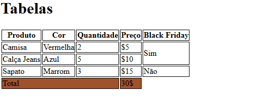

# Projeto de Tabelas

Um projeto de teste de tabelas simples com um arquivo README 🤖




## Tecnologias utilizadas : 

-HTML

1- Clone pro o projeto:

```
git clone https://github.com/ernandes-papa/aula-tabela.git
```

2- Acesse a pasta do projeto :

```
cd aula-tabela
```
